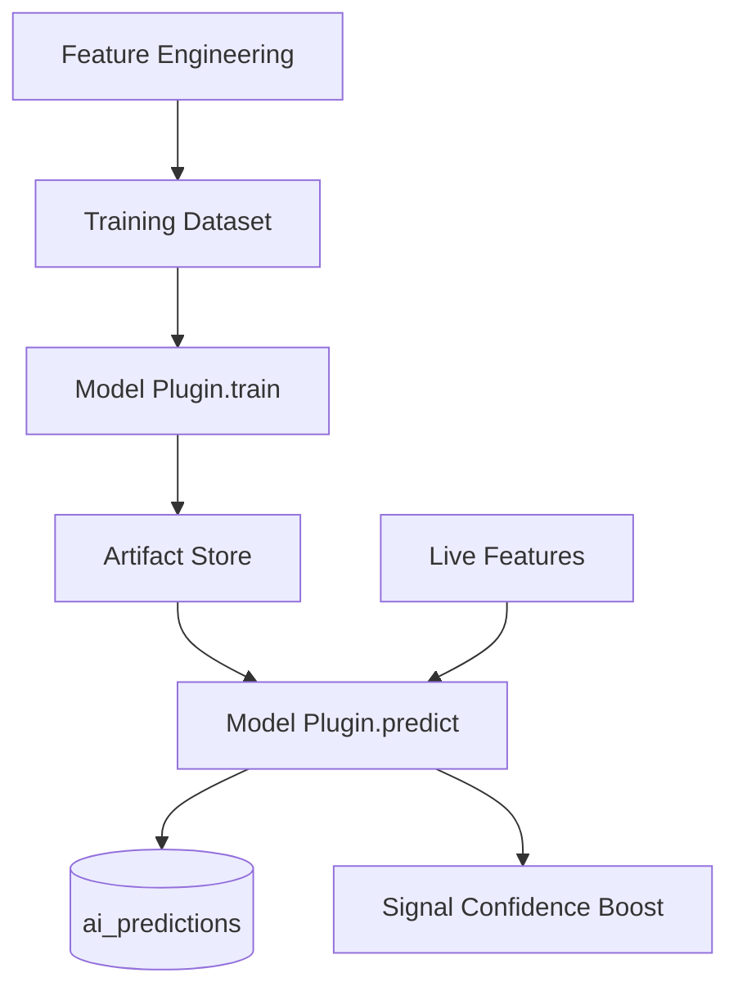

# AI Prediction Engine Design

## Overview

Plugin-based ML pipeline for price direction prediction, volatility forecasting, and signal confidence boosting.

## Model Types

| Type | Output | Use Case |
|------|--------|----------|
| Classification | Direction (up/down/neutral) + probability | Signal confirmation |
| Regression | Price target | Take-profit suggestion |
| Forecast | Multi-step price series | Trend prediction |

## Architecture

## Feature Sources

- OHLCV candles (multi-timeframe)
- Technical indicators (RSI, MACD, etc.)
- SMC patterns (structure, order blocks)
- Volume profile
- Economic events proximity
- News sentiment scores

## Training Pipeline

1. User configures model via API
2. `POST /ai/models/{id}/train` enqueues Celery job
3. Worker builds dataset, runs plugin `train()`
4. Metrics stored in `ai_models.metrics`
5. `AITrainingCompleted` event published
6. User activates model for live inference

## Inference

- Triggered on `IndicatorsCalculated` or on-demand via API
- Predictions stored in `ai_predictions`
- Optional confidence boost applied in Signal Engine

## Built-in Models (Reference)

| Code | Type | Framework |
|------|------|-----------|
| `lstm_direction` | Classification | PyTorch |
| `xgboost_direction` | Classification | XGBoost |
| `prophet_forecast` | Forecast | Prophet |

## Plugin Extension

See [Plugin Architecture](../architecture/plugins.md#5-ai-model-plugins).

## API

See [AI Endpoints](../api/endpoints.md#13-ai-engine).
