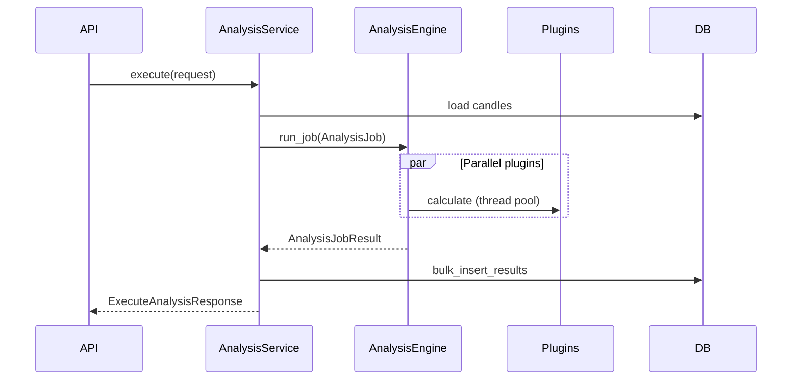

# Analysis Engine (Sprint 4)

Plugin-based analysis framework for technical indicators and future analysis types (Smart Money, candlestick patterns, AI features).

## Architecture

```
CandleBar (standardized input)
        ↓
AnalysisEngine
        ↓
BaseAnalysisPlugin implementations
        ↓
AnalysisBarResult (standardized output)
        ↓
AnalysisResultRepository → PostgreSQL
```

The engine is **independent of REST APIs**. The `AnalysisService` loads candles and invokes the engine; live streaming and replay can call the same engine with `ExecutionMode.LIVE` or `ExecutionMode.REPLAY`.

## Plugin Interface

Every plugin extends `BaseAnalysisPlugin` and implements:

| Method | Purpose |
|--------|---------|
| `plugin_id()` | Stable identifier (`rsi`, `ema`, …) |
| `plugin_name()` | Display name |
| `plugin_version()` | Implementation version (stored with results) |
| `category()` | `trend`, `momentum`, `volatility`, `volume`, … |
| `required_history()` | Minimum candles needed |
| `default_parameters()` | Default config |
| `validate_parameters()` | Pydantic validation |
| `calculate()` | Core computation |
| `output_schema()` | Output field descriptions |
| `metadata()` | Full metadata bundle |

Plugins register via `register_builtin_plugins()` at startup. External plugins can call `AnalysisPluginRegistry.register()`.

## Phase 1 Plugins

| ID | Name | Category |
|----|------|----------|
| `ema` | Exponential Moving Average | trend |
| `sma` | Simple Moving Average | trend |
| `rsi` | Relative Strength Index | momentum |
| `macd` | MACD | momentum |
| `atr` | Average True Range | volatility |
| `bollinger_bands` | Bollinger Bands | volatility |
| `vwap` | VWAP | volume |
| `obv` | On Balance Volume | volume |
| `market_structure` | Swings, trend, BOS, CHoCH, S/R levels | market_structure |

See [Market Structure Engine](../market-structure/overview.md).
| `market_structure` | Swings, trend, BOS, CHoCH, phases, S/R | market_structure |

See [Market Structure Engine](../market-structure/overview.md).

## Storage Model

Table: `analysis_results`

| Column | Description |
|--------|-------------|
| `symbol_id` | FK to symbols |
| `timeframe_id` | FK to timeframes |
| `open_time` | Candle timestamp (PK) |
| `plugin_id` | Plugin identifier (PK) |
| `plugin_version` | Version string (PK) — preserves history |
| `params_hash` | SHA-256 hash of parameters (PK) |
| `values` | JSONB output |
| `computed_at` | Calculation timestamp |

**Primary key:** `(symbol_id, timeframe_id, open_time, plugin_id, plugin_version, params_hash)`

Different plugin versions never overwrite each other (`ON CONFLICT DO NOTHING`).

## API Endpoints

| Method | Path | Description |
|--------|------|-------------|
| GET | `/api/v1/analysis/plugins` | List plugins |
| GET | `/api/v1/analysis/plugins/{plugin_id}` | Plugin metadata |
| POST | `/api/v1/analysis/execute` | Run analysis |
| GET | `/api/v1/analysis/results/{symbol_id}` | Stored results |

### Execute analysis

```bash
curl -X POST http://localhost:8000/api/v1/analysis/execute \
  -H "Content-Type: application/json" \
  -d '{
    "symbol_id": "YOUR_SYMBOL_UUID",
    "timeframe": "1h",
    "plugins": [
      {"plugin_id": "rsi", "parameters": {"period": 14}},
      {"plugin_id": "macd", "parameters": {}}
    ],
    "persist": true
  }'
```

### Retrieve results

```bash
curl "http://localhost:8000/api/v1/analysis/results/SYMBOL_UUID?timeframe=1h&plugin_id=rsi"
```

## Execution Flow



## Creating a New Plugin

1. Create `app/engines/analysis/plugins/my_plugin.py`
2. Subclass `BaseAnalysisPlugin`
3. Implement all required methods
4. Add to `_BUILTIN_PLUGINS` in `plugins/__init__.py`
5. Add pandas-ta comparison test in `tests/unit/`
6. Run `alembic upgrade head` if schema changes needed (usually not)

Example skeleton:

```python
class MyPlugin(BaseAnalysisPlugin):
    @classmethod
    def plugin_id(cls) -> str:
        return "my_plugin"

    def calculate(self, candles, parameters):
        # return list[AnalysisBarResult]
        ...
```

## Replay & Live Compatibility

| Mode | Input source | Status |
|------|--------------|--------|
| `BATCH` | DB candles via service | Implemented |
| `LIVE` | Streaming candle feed | Future |
| `REPLAY` | Backtest/replay buffer | Future |

`AnalysisJob` accepts any `list[CandleBar]` — no REST dependency.

## Testing

```bash
pytest tests/unit/test_analysis_engine.py -v
pytest tests/unit/test_analysis_plugins_pandas_ta.py -v
```

Plugin outputs are validated against **pandas-ta** within tolerance `1e-4` (rel) / `0.05–0.1` (abs) depending on indicator.
