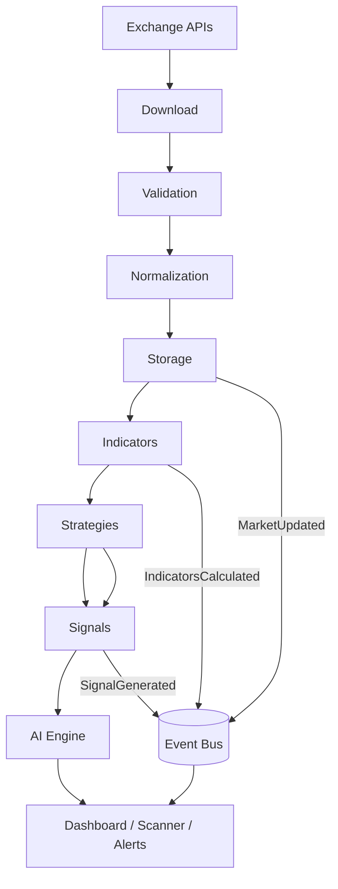
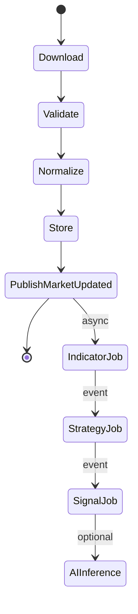
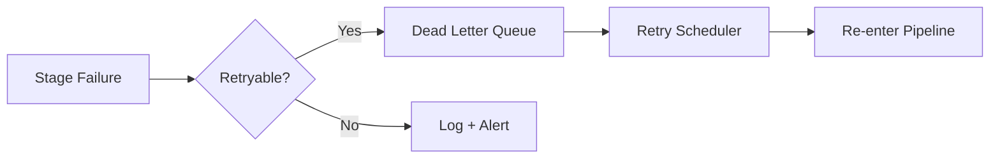

# Data Pipeline

> **Note:** This document defines the pipeline architecture. The Data Engine implementation is deferred to Sprint 3+.

## 1. Pipeline Overview

---

## 2. Stage-by-Stage Breakdown

### Stage 1: Exchange (Source)

External market data providers. Accessed exclusively through **Market Adapters** — never directly by pipeline code.

| Source | Protocol | Data Types |
|--------|----------|------------|
| NSE | REST, file download, WebSocket | EOD, intraday OHLCV |
| Binance / Bybit | REST, WebSocket | Klines, agg trades, order book |
| Forex | REST, WebSocket | OHLCV, ticks |
| Commodities | REST | OHLCV |

---

### Stage 2: Download

**Module:** `app/pipeline/downloader.py`

| Mode | Trigger | Behavior |
|------|---------|----------|
| Historical sync | Cron / manual API | Batch fetch date ranges per symbol/timeframe |
| Live ingestion | WebSocket / polling | Stream ticks and forming candles |
| Gap fill | Scheduler detects missing bars | Re-download specific ranges |

**Responsibilities:**
- Resolve adapter via `AdapterRegistry`
- Respect rate limits per exchange
- Chunk large date ranges (e.g. 1000 bars per request)
- Emit download metrics (bars fetched, latency, errors)
- Enqueue failed downloads for retry

**Output:** Raw exchange-specific payloads (not yet normalized).

---

### Stage 3: Validation

**Module:** `app/pipeline/validator.py`

Validates raw data before persistence. Rejects or quarantines bad bars.

| Check | Rule | Action on Failure |
|-------|------|-------------------|
| OHLC integrity | `low ≤ open, close ≤ high` | Reject bar |
| Positive volume | `volume ≥ 0` | Reject bar |
| Timestamp order | `ts > previous_ts` | Flag gap, continue |
| Duplicate detection | Same `(symbol, timeframe, ts)` | Skip (idempotent) |
| Price sanity | `|change| < threshold` vs prev close | Quarantine + alert |
| Missing fields | Required fields present | Reject bar |
| Future timestamp | `ts ≤ now() + tolerance` | Reject bar |

**Output:** Validated raw records + validation report (counts, quarantined bars).

---

### Stage 4: Normalization

**Module:** `app/pipeline/normalizer.py` (shared) + per-adapter `normalizer.py`

Converts exchange-specific formats to unified domain objects.

| Field | Normalized Format |
|-------|-------------------|
| Timestamp | UTC `datetime` with timezone |
| OHLCV | `Decimal` precision per asset class |
| Symbol | Internal `symbol_id` (FK lookup) |
| Timeframe | Canonical enum: `1m`, `5m`, `15m`, `1h`, `4h`, `1d`, `1w` |
| Volume | Base asset volume (crypto) or shares (equity) |

**Output:** List of domain `Candle` objects ready for storage.

---

### Stage 5: Storage

**Module:** `app/pipeline/writer.py`

Persists normalized candles to PostgreSQL/TimescaleDB.

| Operation | Strategy |
|-----------|----------|
| Historical bulk | Batch insert via `COPY` or `INSERT ... ON CONFLICT DO NOTHING` |
| Live single bar | Upsert (update forming candle or insert completed) |
| Indicator values | Batch insert into partitioned `indicator_values` |
| Cache warm | Push latest N bars to Redis |

After successful write, publishes **`MarketUpdated`** event.

**Output:** Persisted rows + event on bus.

---

### Stage 6: Indicators

**Module:** `app/engines/indicators/engine.py`

Triggered by `MarketUpdated` (live) or batch job (historical backfill).

| Step | Action |
|------|--------|
| 1 | Load candle window from DB or Redis cache |
| 2 | Resolve indicator plugins from registry |
| 3 | Compute values per symbol/timeframe |
| 4 | Persist to `indicator_values` |
| 5 | Publish **`IndicatorsCalculated`** |

---

### Stage 7: Strategies

**Module:** `app/engines/strategies/engine.py`

Subscribes to `IndicatorsCalculated` and/or polls on schedule.

| Step | Action |
|------|--------|
| 1 | Load active strategies for symbol/timeframe |
| 2 | Execute strategy plugin with indicator + candle context |
| 3 | Evaluate entry/exit conditions |
| 4 | Pass results to Signal Engine |

Multi-timeframe: strategy declares required timeframes; engine fetches all before evaluation.

---

### Stage 8: Signals

**Module:** `app/engines/signals/engine.py`

| Step | Action |
|------|--------|
| 1 | Aggregate strategy outputs |
| 2 | Apply risk filters |
| 3 | Score confidence (0.0–1.0) |
| 4 | Persist to `signals` |
| 5 | Publish **`SignalGenerated`** |

Subscribers: Alerts, Paper Trading, Dashboard WebSocket, AI feedback loop.

---

### Stage 9: AI

**Module:** `app/engines/ai/inference.py`

| Step | Action |
|------|--------|
| 1 | Build feature vector from candles + indicators + SMC |
| 2 | Run registered model plugin |
| 3 | Persist prediction to `ai_predictions` |
| 4 | Optionally boost or reduce signal confidence |

Training pipeline (async job) publishes **`AITrainingCompleted`** when done.

---

### Stage 10: Dashboard

**Consumers:** Web UI, Mobile, WebSocket clients, Scanner.

| Data Source | Delivery |
|-------------|----------|
| Latest candles | Redis cache + REST |
| Indicator overlays | REST + WebSocket |
| Signals / alerts | WebSocket push |
| Scanner results | Redis + WebSocket |
| AI predictions | REST |

---

## 3. Pipeline Orchestration

**Module:** `app/pipeline/orchestrator.py`

| Job Type | Queue | Priority |
|----------|-------|----------|
| Live tick processing | High | Real-time |
| Historical backfill | Low | Batch overnight |
| Indicator backfill | Medium | After candle import |
| AI training | Low | Off-peak hours |

---

## 4. Idempotency & Exactly-Once Semantics

| Concern | Solution |
|---------|----------|
| Duplicate candles | `UNIQUE (symbol_id, timeframe_id, open_time)` + `ON CONFLICT DO NOTHING` |
| Duplicate indicator values | Same unique constraint pattern |
| Event redelivery | Idempotent handlers keyed by `(event_id)` in Redis |
| Partial batch failure | Transaction per batch; failed rows logged to quarantine table |

---

## 5. Failure Recovery

---

## 6. Observability

Every stage emits structured logs and metrics:

| Metric | Type |
|--------|------|
| `pipeline.bars_downloaded` | Counter |
| `pipeline.bars_rejected` | Counter |
| `pipeline.stage_latency_ms` | Histogram |
| `pipeline.gap_count` | Gauge |
| `pipeline.queue_depth` | Gauge |
