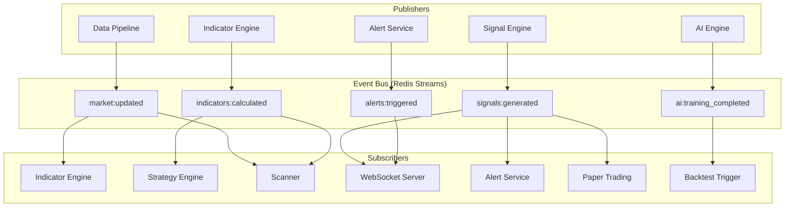
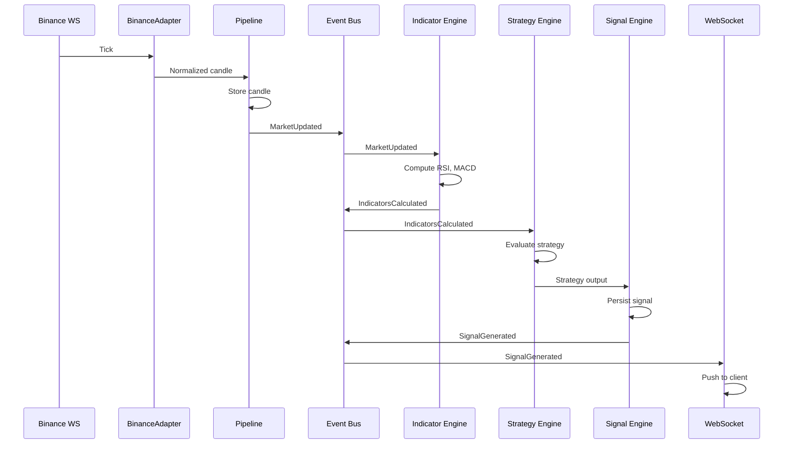

# Event-Driven Architecture

## 1. Overview

TradeMind AI uses an **event-driven architecture** to decouple data ingestion, computation engines, and notification services. Producers publish events; consumers subscribe asynchronously. Synchronous REST remains for queries and commands.



---

## 2. Technology Choice

| Option | Use Case |
|--------|----------|
| **Redis Streams** (primary) | Persistent, consumer groups, replay, at-least-once |
| Redis Pub/Sub | Ephemeral fan-out (WebSocket broadcast) |
| Celery tasks | Heavy async work triggered by events |

---

## 3. Event Catalog

### 3.1 `MarketUpdated`

Published when new or updated candles are persisted.

| Field | Type | Description |
|-------|------|-------------|
| `event_id` | UUID | Unique event identifier |
| `timestamp` | datetime | Event publish time (UTC) |
| `symbol_id` | UUID | Internal symbol reference |
| `exchange_code` | string | e.g. `nse`, `binance` |
| `timeframe` | string | e.g. `5m`, `1d` |
| `candle_count` | int | Number of bars written |
| `latest_open_time` | datetime | Most recent bar timestamp |
| `is_live` | bool | Live tick vs historical batch |

**Publishers:** `app/pipeline/writer.py`  
**Subscribers:** Indicator Engine, Live Scanner, WebSocket (tick channel)

---

### 3.2 `IndicatorsCalculated`

Published when indicator values are computed and stored.

| Field | Type | Description |
|-------|------|-------------|
| `event_id` | UUID | Unique event identifier |
| `timestamp` | datetime | Event publish time |
| `symbol_id` | UUID | Symbol reference |
| `timeframe` | string | Timeframe code |
| `indicators` | list | `[{code, params_hash, latest_value, open_time}]` |
| `calculation_ms` | float | Compute duration |

**Publishers:** `app/engines/indicators/engine.py`  
**Subscribers:** Strategy Engine, Scanner, Smart Money Engine, Alert Evaluator

---

### 3.3 `SignalGenerated`

Published when the Signal Engine produces an actionable signal.

| Field | Type | Description |
|-------|------|-------------|
| `event_id` | UUID | Unique event identifier |
| `timestamp` | datetime | Event publish time |
| `signal_id` | UUID | Persisted signal reference |
| `symbol_id` | UUID | Symbol reference |
| `strategy_id` | UUID | Source strategy |
| `direction` | enum | `LONG`, `SHORT`, `NEUTRAL` |
| `strength` | enum | `WEAK`, `MODERATE`, `STRONG` |
| `confidence` | float | 0.0 – 1.0 |
| `entry_price` | decimal | Suggested entry |
| `stop_loss` | decimal | Suggested SL |
| `take_profit` | decimal | Suggested TP |
| `timeframes` | list | Timeframes involved |

**Publishers:** `app/engines/signals/engine.py`  
**Subscribers:** Alert Service, Paper Trading, WebSocket, Dashboard

---

### 3.4 `AlertTriggered`

Published when a user alert condition is met.

| Field | Type | Description |
|-------|------|-------------|
| `event_id` | UUID | Unique event identifier |
| `timestamp` | datetime | Event publish time |
| `alert_id` | UUID | Alert rule reference |
| `user_id` | UUID | Alert owner |
| `symbol_id` | UUID | Related symbol |
| `condition_met` | string | Human-readable condition |
| `trigger_value` | JSON | Values that triggered the alert |
| `channels` | list | `email`, `push`, `webhook` |

**Publishers:** `app/services/alerts/evaluator.py`  
**Subscribers:** Notification dispatchers, WebSocket, audit log

---

### 3.5 `AITrainingCompleted`

Published when an AI model training job finishes.

| Field | Type | Description |
|-------|------|-------------|
| `event_id` | UUID | Unique event identifier |
| `timestamp` | datetime | Event publish time |
| `model_id` | UUID | `ai_models` reference |
| `model_code` | string | Plugin identifier |
| `status` | enum | `SUCCESS`, `FAILED` |
| `metrics` | JSON | `{accuracy, loss, f1, ...}` |
| `duration_seconds` | float | Training duration |
| `artifact_path` | string | Model file location |

**Publishers:** `app/engines/ai/trainer.py`  
**Subscribers:** Model registry updater, notification service, backtest re-run trigger

---

## 4. Additional Events (Future)

| Event | Purpose |
|-------|---------|
| `BacktestCompleted` | Notify user, store results |
| `PaperTradeExecuted` | Update portfolio, risk checks |
| `RiskLimitBreached` | Halt trading, notify user |
| `SymbolDelisted` | Cleanup watchlists, halt data sync |
| `ExchangeMaintenance` | Pause adapter, notify ops |

---

## 5. Publisher Interface

```python
# Design specification

class EventPublisher(ABC):
    async def publish(self, event: BaseEvent) -> None: ...

class RedisStreamPublisher(EventPublisher):
    async def publish(self, event: BaseEvent) -> None:
        # XADD stream_name {fields}
        ...
```

All events inherit from `BaseEvent` with `event_id`, `timestamp`, `event_type`.

---

## 6. Subscriber Interface

```python
# Design specification

class EventHandler(ABC):
    @property
    def event_type(self) -> str: ...

    async def handle(self, event: BaseEvent) -> None: ...

class EventSubscriber:
    async def start(self, handlers: list[EventHandler]) -> None:
        # XREADGROUP with consumer group per service
        ...
```

Each subscriber service has its own **consumer group** for independent scaling and replay.

---

## 7. Delivery Guarantees

| Guarantee | Mechanism |
|-----------|-----------|
| At-least-once delivery | Redis Streams consumer groups + ACK |
| Idempotent processing | Handler checks `event_id` in processed set (Redis SET, TTL 24h) |
| Ordering | Per-stream FIFO; cross-symbol parallelism |
| Replay | `XREAD` from arbitrary stream ID for backfill |

---

## 8. Event Flow Example: Live Signal



---

## 9. Module Layout

```
app/events/
├── bus.py              # EventBus facade
├── publisher.py        # RedisStreamPublisher
├── subscriber.py       # Consumer group runner
├── schemas/            # Event payload dataclasses
│   ├── base.py
│   ├── market_updated.py
│   ├── indicators_calculated.py
│   ├── signal_generated.py
│   ├── alert_triggered.py
│   └── ai_training_completed.py
└── handlers/
    ├── indicators_on_market_updated.py
    ├── strategies_on_indicators_calculated.py
    └── ...
```
