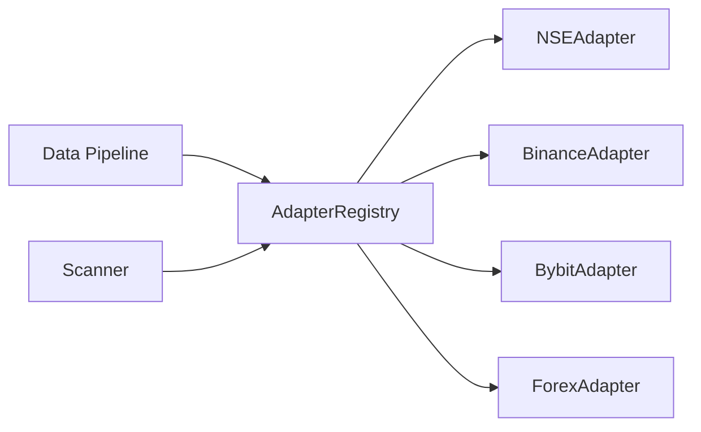
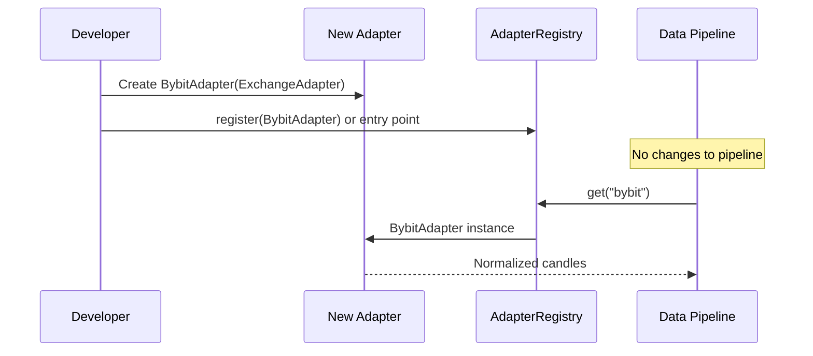

# Market Adapter Design

## 1. Purpose

Every exchange (NSE, Binance, Bybit, forex brokers) exposes different APIs, data formats, and rate limits. The **Market Adapter** layer hides these differences behind a unified interface so the Data Pipeline, Scanner, and Engines never depend on exchange-specific code.

---

## 2. Abstract Interface

```python
# Design specification — NOT production code

from abc import ABC, abstractmethod
from collections.abc import AsyncIterator
from datetime import datetime
from typing import Any

from app.domain.entities.candle import Candle
from app.domain.entities.symbol import Symbol
from app.domain.enums.market_type import MarketType
from app.domain.value_objects.timeframe import Timeframe


class ExchangeAdapter(ABC):
    """Unified interface for all market data sources."""

    # ── Identity ──────────────────────────────────────────────

    @property
    @abstractmethod
    def exchange_code(self) -> str:
        """Unique code: 'nse', 'binance', 'bybit', 'oanda'."""
        ...

    @property
    @abstractmethod
    def market_types(self) -> list[MarketType]:
        """Supported market types: EQUITY, CRYPTO, FOREX, COMMODITY."""
        ...

    # ── Symbol Discovery ────────────────────────────────────────

    @abstractmethod
    async def search_symbols(
        self,
        query: str,
        *,
        market_type: MarketType | None = None,
        limit: int = 50,
    ) -> list[Symbol]:
        """Search tradable instruments by name or ticker."""
        ...

    @abstractmethod
    async def get_symbol(self, symbol_code: str) -> Symbol | None:
        """Fetch a single symbol by exchange-native code."""
        ...

    @abstractmethod
    async def list_symbols(
        self,
        *,
        market_type: MarketType | None = None,
        active_only: bool = True,
    ) -> AsyncIterator[Symbol]:
        """Stream all symbols (paginated internally)."""
        ...

    # ── Historical Data ─────────────────────────────────────────

    @abstractmethod
    async def get_historical_data(
        self,
        symbol_code: str,
        timeframe: Timeframe,
        start: datetime,
        end: datetime,
    ) -> list[Candle]:
        """Fetch OHLCV candles for a date range."""
        ...

    # ── Live Data ───────────────────────────────────────────────

    @abstractmethod
    async def get_live_data(
        self,
        symbol_code: str,
        timeframe: Timeframe,
        limit: int = 1,
    ) -> list[Candle]:
        """Fetch the most recent candles (REST snapshot)."""
        ...

    @abstractmethod
    async def subscribe_ticks(
        self,
        symbol_codes: list[str],
    ) -> AsyncIterator[Tick]:
        """WebSocket stream of real-time tick/trade data."""
        ...

    @abstractmethod
    async def subscribe_candles(
        self,
        symbol_code: str,
        timeframe: Timeframe,
    ) -> AsyncIterator[Candle]:
        """WebSocket stream of forming/completed candles."""
        ...

    # ── Market Metadata ─────────────────────────────────────────

    @abstractmethod
    async def get_market_sessions(self) -> list[MarketSession]:
        """Trading hours, holidays, pre/post market."""
        ...

    @abstractmethod
    async def get_exchange_info(self) -> ExchangeInfo:
        """Rate limits, supported timeframes, status."""
        ...

    # ── Health ──────────────────────────────────────────────────

    @abstractmethod
    async def health_check(self) -> AdapterHealth:
        """Probe connectivity and API status."""
        ...
```

---

## 3. Supporting Types

| Type | Fields | Purpose |
|------|--------|---------|
| `Tick` | symbol, price, volume, timestamp, side | Raw trade tick |
| `MarketSession` | open, close, timezone, session_type | Trading hours |
| `ExchangeInfo` | rate_limits, timeframes, status | Adapter metadata |
| `AdapterHealth` | status, latency_ms, message | Health probe result |

All types live in `app/domain/` — adapters return domain objects, never ORM models.

---

## 4. Adapter Registry



```python
# Design specification

class AdapterRegistry:
    """Resolves adapter by exchange_code. Populated at startup via entry points."""

    def register(self, adapter_class: type[ExchangeAdapter]) -> None: ...
    def get(self, exchange_code: str) -> ExchangeAdapter: ...
    def list_exchanges(self) -> list[str]: ...
```

Registration happens in `app/adapters/registry.py`:

1. **Built-in adapters** — imported explicitly at startup
2. **Plugin adapters** — discovered via `pyproject.toml` entry points:

```toml
[project.entry-points."trademind.adapters"]
nse = "app.adapters.nse.adapter:NSEAdapter"
binance = "app.adapters.binance.adapter:BinanceAdapter"
```

---

## 5. Per-Adapter Internal Structure

Each adapter follows the same internal layout:

```
app/adapters/binance/
├── adapter.py       # Implements ExchangeAdapter
├── client.py        # Raw HTTP/WebSocket client
├── normalizer.py    # Exchange format → domain Candle/Symbol
├── schemas.py       # Exchange-specific Pydantic models (internal only)
└── constants.py     # Endpoints, rate limits
```

| File | Responsibility |
|------|----------------|
| `client.py` | HTTP calls, WebSocket connection, retries, rate limiting |
| `normalizer.py` | Maps exchange JSON to unified `Candle`, `Symbol` |
| `adapter.py` | Implements interface; delegates to client + normalizer |

---

## 6. Adding a New Exchange (Open/Closed Principle)



**Steps to add Bybit (example):**

1. Create `app/adapters/bybit/` with `adapter.py`, `client.py`, `normalizer.py`
2. Implement all `ExchangeAdapter` abstract methods
3. Register in `AdapterRegistry` or via entry point
4. Insert row in `exchanges` table via seed script
5. **Zero changes** to pipeline, engines, API, or other adapters

---

## 7. Error Handling

| Error Type | When | Adapter Behavior |
|------------|------|------------------|
| `RateLimitError` | 429 from exchange | Exponential backoff, respect `Retry-After` |
| `SymbolNotFoundError` | Invalid symbol | Raise domain exception |
| `ConnectionError` | Network failure | Retry with circuit breaker |
| `AuthenticationError` | Bad API key | Fail fast, log, alert ops |
| `DataFormatError` | Unexpected response | Log raw payload, skip bar |

All adapter exceptions inherit from `AdapterError` in `app/core/exceptions.py`.

---

## 8. Rate Limiting Strategy

Each adapter declares limits in `get_exchange_info()`. A shared `RateLimiter` in `app/adapters/rate_limiter.py` enforces per-exchange token buckets so multiple workers don't exceed quotas.

---

## 9. NSE vs Crypto: Key Differences Handled by Adapters

| Concern | NSE | Binance |
|---------|-----|---------|
| Auth | Session token / API key | HMAC signature |
| Historical | End-of-day + intraday files | REST klines |
| Live | WebSocket (limited) | WebSocket agg trades |
| Symbol format | `RELIANCE` | `BTCUSDT` |
| Timezone | IST | UTC |
| Session | 09:15–15:30 IST | 24/7 |

Normalizers convert all to UTC timestamps and unified OHLCV in `Candle`.

---

## 10. Testing Strategy

| Test Type | Scope |
|-----------|-------|
| Unit | Normalizer: exchange JSON → domain object |
| Integration | Client against exchange sandbox/testnet |
| Contract | Every adapter passes shared `AdapterContractTest` |
| Mock | Pipeline tests use `MockExchangeAdapter` |
