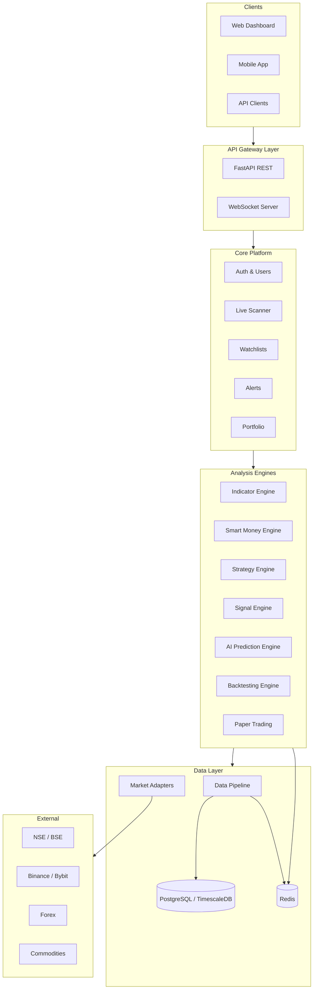
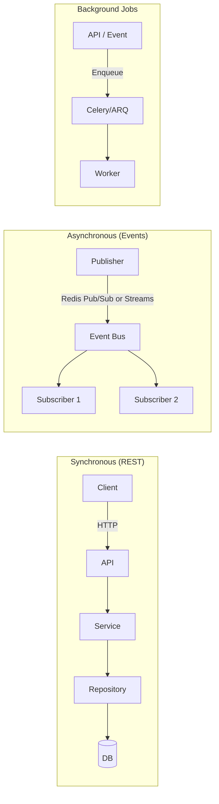
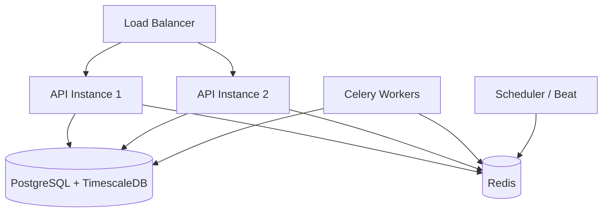
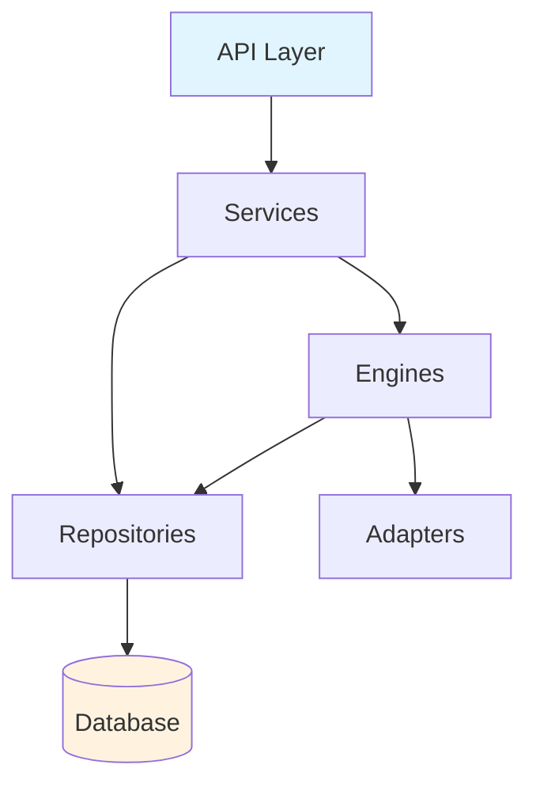

# System Architecture Overview

## 1. Vision

TradeMind AI is a **multi-asset trading intelligence platform** — not a signal generator. It ingests market data from NSE, crypto exchanges, forex, and commodities; runs indicators, Smart Money analysis, strategies, AI predictions, backtests, and paper trading; and surfaces results via scanners, alerts, watchlists, and dashboards.

---

## 2. High-Level Architecture

---

## 3. Major Modules

### 3.1 API Gateway (`app/api/`)

| Module | Responsibility |
|--------|----------------|
| **REST API** | Versioned HTTP endpoints for all platform operations |
| **WebSocket** | Real-time ticks, signals, alerts to connected clients |
| **Auth middleware** | JWT validation, role checks on protected routes |

Communicates with: all service layers. Does not contain business logic.

---

### 3.2 User Management (`app/services/users/`)

Authentication, authorization, profiles, subscription tiers. Communicates with: `users` table, Auth providers (future OAuth).

---

### 3.3 Market Adapters (`app/adapters/`)

Abstract interface per exchange/broker. Each adapter implements: historical fetch, live data, tick subscription, symbol search. Communicates with: Data Pipeline (upstream), external APIs (downstream).

See [Market Adapters](./market-adapters.md).

---

### 3.4 Data Pipeline (`app/pipeline/`)

Orchestrates: Download → Validation → Normalization → Storage. Does **not** implement the Data Engine yet (Sprint 3+). Communicates with: Adapters, PostgreSQL, Redis, Event Bus.

See [Data Pipeline](./data-pipeline.md).

---

### 3.5 Data Storage (`app/database/`, TimescaleDB)

PostgreSQL for relational data. TimescaleDB hypertables for `candles` (millions+ rows). Communicates with: all engines via repositories.

See [Database Schema](../database/schema-design.md).

---

### 3.6 Indicator Engine (`app/engines/indicators/`)

Computes technical indicators from candle data. Plugin-based. Communicates with: candles, `indicator_values`, Event Bus (`IndicatorsCalculated`).

---

### 3.7 Smart Money Engine (`app/engines/smart_money/`)

Order blocks, liquidity zones, BOS/CHoCH, FVG. Communicates with: candles, indicator values, Event Bus.

See [Smart Money](../smart-money/overview.md).

---

### 3.8 Strategy Engine (`app/engines/strategies/`)

Evaluates user-defined or built-in strategies across timeframes. Plugin-based. Communicates with: indicators, SMC output, `strategies`, `strategy_versions`.

---

### 3.9 Signal Engine (`app/engines/signals/`)

Aggregates strategy output into actionable signals with confidence scores. Publishes `SignalGenerated`. Communicates with: strategies, AI Engine, `signals` table.

---

### 3.10 AI Prediction Engine (`app/engines/ai/`)

Training, inference, model registry. Plugin-based model backends. Communicates with: candles, indicators, `ai_models`, `ai_predictions`. Publishes `AITrainingCompleted`.

See [AI Engine](../ai/overview.md).

---

### 3.11 Backtesting Engine (`app/engines/backtesting/`)

Historical simulation of strategies with slippage and commission models. Communicates with: candles, strategies, `backtests`, `trades`.

---

### 3.12 Paper Trading Engine (`app/engines/paper_trading/`)

Simulated order execution against live prices. Communicates with: live data, signals, `trades`, portfolios.

---

### 3.13 Risk Management (`app/engines/risk/`)

Position sizing, max drawdown, exposure limits. Gate between signals and trade execution.

---

### 3.14 Live Market Scanner (`app/services/scanner/`)

Real-time filtering of symbols by indicator/SMC/strategy criteria. Communicates with: Redis (hot data), Indicator Engine, WebSocket.

---

### 3.15 Alerts (`app/services/alerts/`)

User-defined conditions → notifications (push, email, webhook). Subscribes to `AlertTriggered`, `SignalGenerated`.

---

### 3.16 Watchlists & Portfolios (`app/services/watchlists/`, `app/services/portfolios/`)

User-curated symbol lists and P&L tracking.

---

## 4. Communication Patterns

| Pattern | Use Case | Technology |
|---------|----------|------------|
| REST | CRUD, queries, backtest triggers | FastAPI |
| WebSocket | Live ticks, scanner updates, alerts | FastAPI WebSocket + Redis pub/sub |
| Event Bus | Decouple engines (signals, indicators, AI) | Redis Streams or Pub/Sub |
| Job Queue | Heavy work: backtests, bulk downloads, AI training | Celery + Redis |
| Cache | Hot candles, scanner state, session data | Redis |

---

## 5. Deployment Topology (Logical)

See [Deployment](../deployment/overview.md) for full infrastructure details.

---

## 6. Module Dependency Graph

**Rule:** Dependencies flow inward. Engines never import from API. Adapters never import from Services.

---

## 7. Sprint Boundaries

| Sprint | Scope |
|--------|-------|
| Sprint 1 ✅ | FastAPI foundation, health, DB session, Alembic |
| Sprint 2 ✅ (this doc) | Architecture, schema, API design, docs |
| Sprint 3+ | Data Engine, adapters, pipeline implementation |
| Future | F&O, BSE, advanced AI, live execution |
