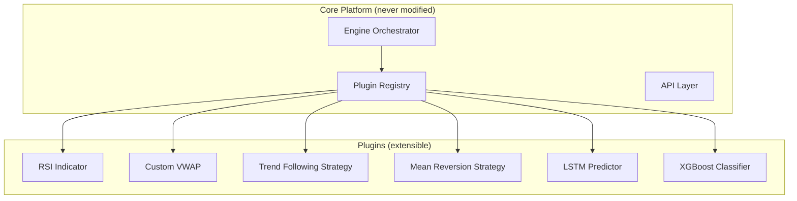
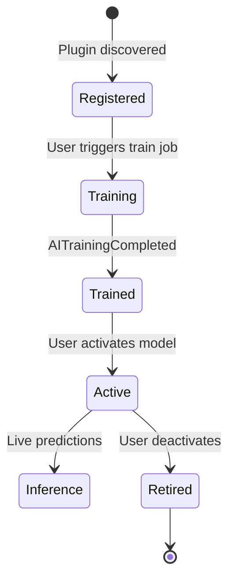
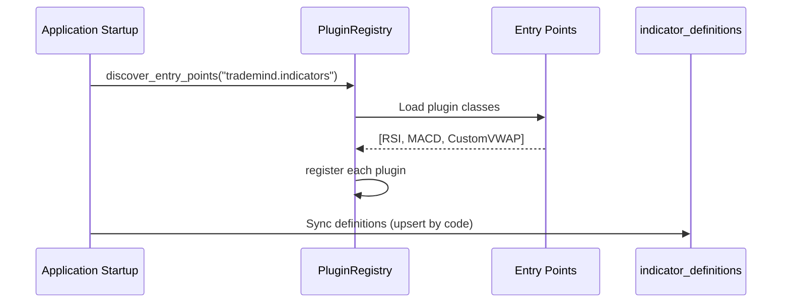

# Plugin Architecture

## 1. Design Goal

Developers must be able to add **strategies**, **indicators**, and **AI models** without modifying core platform code. The platform follows the **Open/Closed Principle**: open for extension, closed for modification.

---

## 2. Plugin Types



| Plugin Type | Base Class | Registry | Entry Point Group |
|-------------|------------|----------|-------------------|
| Indicator | `BaseIndicator` | `IndicatorRegistry` | `trademind.indicators` |
| Strategy | `BaseStrategy` | `StrategyRegistry` | `trademind.strategies` |
| AI Model | `BaseAIModel` | `AIModelRegistry` | `trademind.ai_models` |
| Exchange Adapter | `ExchangeAdapter` | `AdapterRegistry` | `trademind.adapters` |

---

## 3. Indicator Plugins

### 3.1 Base Interface

```python
# Design specification

class BaseIndicator(ABC):
    @classmethod
    @abstractmethod
    def code(cls) -> str:
        """Unique identifier: 'rsi', 'macd', 'custom_vwap'."""
        ...

    @classmethod
    @abstractmethod
    def name(cls) -> str:
        """Display name: 'Relative Strength Index'."""
        ...

    @classmethod
    @abstractmethod
    def parameters_schema(cls) -> type[BaseModel]:
        """Pydantic model defining configurable parameters."""
        ...

    @classmethod
    @abstractmethod
    def output_schema(cls) -> type[BaseModel]:
        """Pydantic model defining output fields."""
        ...

    @abstractmethod
    def required_candles(self) -> int:
        """Minimum candle count for warm-up."""
        ...

    @abstractmethod
    def compute(self, candles: list[Candle], params: BaseModel) -> list[IndicatorOutput]:
        """Compute indicator values from candle series."""
        ...
```

### 3.2 Registration

**Built-in:** Imported in `app/engines/indicators/builtin/__init__.py`

**External plugin:**

```toml
# pyproject.toml of plugin package
[project.entry-points."trademind.indicators"]
my_custom_vwap = "my_plugin.indicators.vwap:CustomVWAP"
```

```python
# At startup
IndicatorRegistry.discover_entry_points()
```

### 3.3 Database Link

Each plugin's `code` maps to a row in `indicator_definitions`. Parameters are stored as JSONB in `indicator_values.params`.

---

## 4. Strategy Plugins

### 4.1 Base Interface

```python
# Design specification

class BaseStrategy(ABC):
    @classmethod
    @abstractmethod
    def code(cls) -> str: ...

    @classmethod
    @abstractmethod
    def name(cls) -> str: ...

    @classmethod
    @abstractmethod
    def parameters_schema(cls) -> type[BaseModel]: ...

    @classmethod
    @abstractmethod
    def required_timeframes(cls) -> list[str]:
        """e.g. ['1h', '4h', '1d'] for multi-TF strategies."""
        ...

    @classmethod
    @abstractmethod
    def required_indicators(cls) -> list[IndicatorRequirement]:
        """Indicators this strategy needs computed first."""
        ...

    @abstractmethod
    def evaluate(
        self,
        context: StrategyContext,
        params: BaseModel,
    ) -> StrategyResult:
        """
        StrategyContext contains candles, indicators, SMC data per timeframe.
        StrategyResult: direction, confidence, entry, SL, TP, metadata.
        """
        ...
```

### 4.2 Versioning

Strategies are versioned in `strategy_versions`:

- User creates strategy → version 1
- User edits parameters or logic reference → version 2 (immutable history)
- Backtests and signals reference specific `strategy_version_id`

### 4.3 Registration

```toml
[project.entry-points."trademind.strategies"]
trend_follow = "my_plugin.strategies.trend:TrendFollowingStrategy"
```

---

## 5. AI Model Plugins

### 5.1 Base Interface

```python
# Design specification

class BaseAIModel(ABC):
    @classmethod
    @abstractmethod
    def code(cls) -> str: ...

    @classmethod
    @abstractmethod
    def name(cls) -> str: ...

    @classmethod
    @abstractmethod
    def parameters_schema(cls) -> type[BaseModel]: ...

    @abstractmethod
    def required_features(self) -> list[FeatureSpec]:
        """Candles, indicators, SMC features needed for inference."""
        ...

    @abstractmethod
    async def train(self, dataset: TrainingDataset, params: BaseModel) -> TrainingResult:
        """Train model; return metrics and artifact path."""
        ...

    @abstractmethod
    async def predict(self, features: FeatureVector, params: BaseModel) -> Prediction:
        """Run inference on a single feature vector."""
        ...

    @abstractmethod
    async def save(self, path: str) -> None: ...

    @abstractmethod
    async def load(self, path: str) -> None: ...
```

### 5.2 Model Lifecycle



Stored in `ai_models` (registry metadata) and `ai_predictions` (inference output).

---

## 6. Registry Pattern (Shared)

```python
# Design specification

class PluginRegistry(Generic[T]):
    def register(self, plugin_class: type[T]) -> None: ...
    def get(self, code: str) -> type[T]: ...
    def list_all(self) -> list[type[T]]: ...
    def discover_entry_points(self, group: str) -> None: ...
```

All registries share this pattern. Initialized once at application startup in `app/container.py`.

---

## 7. Plugin Discovery Flow



On startup, the platform syncs discovered plugins to database tables so the API can list available indicators/strategies/models.

---

## 8. Sandboxing & Security

| Concern | Mitigation |
|---------|------------|
| Malicious plugin code | Plugins run in same process initially; future: subprocess sandbox |
| Resource exhaustion | Timeout on `compute()` / `evaluate()` / `predict()` |
| Parameter injection | All params validated via Pydantic schema before execution |
| Third-party plugins | Require explicit admin enable in config |

---

## 9. Developer Workflow

### Adding a Custom Indicator

1. Create Python package with `BaseIndicator` subclass
2. Define `parameters_schema` and `output_schema`
3. Implement `compute()`
4. Add entry point in `pyproject.toml`
5. `pip install` the package
6. Restart API — plugin auto-discovered and synced to `indicator_definitions`
7. Use via API: `POST /api/v1/indicators/compute` with `{code, params, symbol, timeframe}`

**No changes to core codebase.**

### Adding a Custom Strategy

Same flow with `BaseStrategy` → entry point `trademind.strategies` → available in `POST /api/v1/strategies`.

### Adding a Custom AI Model

Same flow with `BaseAIModel` → entry point `trademind.ai_models` → train via `POST /api/v1/ai/models/{id}/train`.

---

## 10. Built-in vs External Plugins

| Location | Purpose |
|----------|---------|
| `app/engines/indicators/builtin/` | Core indicators shipped with platform |
| `app/engines/strategies/builtin/` | Reference strategies |
| `app/engines/ai/models/` | Reference ML models |
| `plugins/` (repo root) | Optional bundled plugins |
| External packages | Third-party plugins via pip |

---

## 11. Testing Plugins

Every plugin must pass contract tests:

```python
# tests/unit/engines/test_indicator_contract.py

@pytest.mark.parametrize("indicator_class", IndicatorRegistry.list_all())
def test_indicator_contract(indicator_class):
    assert indicator_class.code()
    assert indicator_class.parameters_schema()
    # ... warm-up, compute with sample candles, output shape
```

External plugin authors can run the same contract test against their plugin before publishing.
