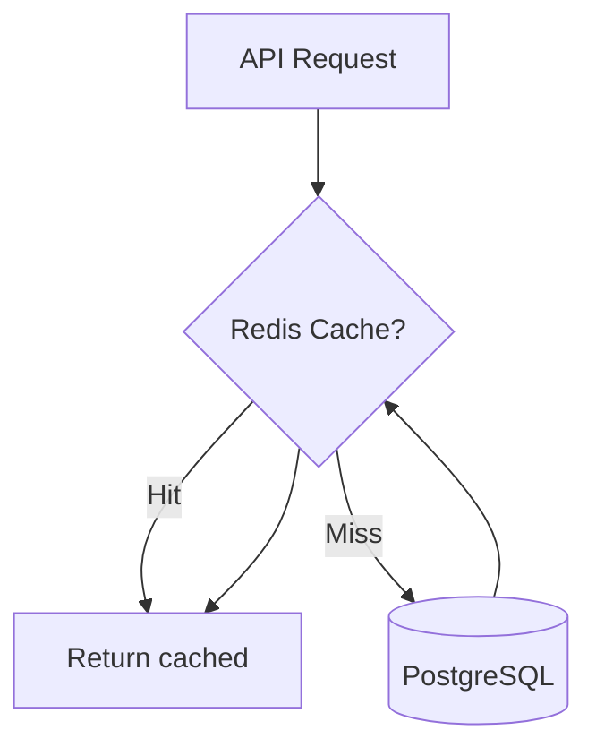
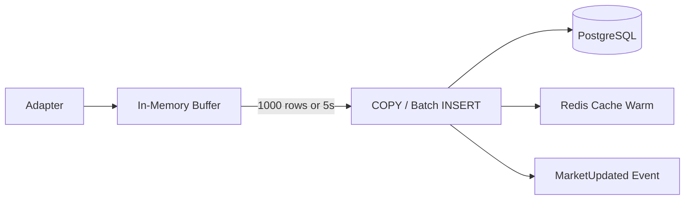
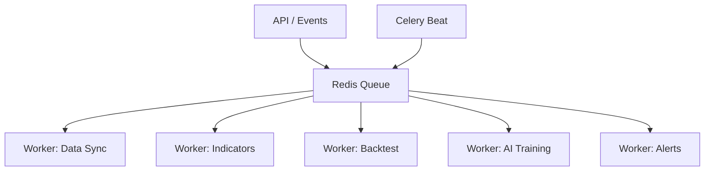
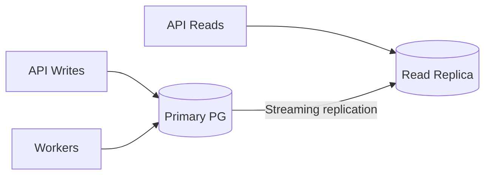

# Database Performance Strategy

## 1. Partitioning

### 1.1 TimescaleDB Hypertables

| Table | Partition Key | Chunk Interval | Rationale |
|-------|---------------|----------------|-----------|
| `candles` | `open_time` | 1 month | Time-range queries dominate; monthly chunks balance scan speed vs chunk count |
| `indicator_values` | `open_time` | 1 month | Same access pattern as candles |
| `ai_predictions` | `prediction_time` | 1 month | Inference history grows linearly |
| `audit_logs` | `created_at` | 1 month | Append-only; old partitions archived |

### 1.2 Native PostgreSQL Partitioning (Optional)

For tables without TimescaleDB:

| Table | Strategy | Key |
|-------|----------|-----|
| `signals` | Range | `signal_time` monthly |
| `trades` | Range | `opened_at` monthly |
| `news` | Range | `published_at` monthly |

### 1.3 Retention Policies

```sql
-- Design specification
SELECT add_retention_policy('candles', INTERVAL '2 years', 
    if_not_exists => true,
    -- Only for 1m timeframe via custom job
);
```

| Timeframe | Retention |
|-----------|-----------|
| `1m`, `5m` | 2 years |
| `15m`, `1h` | 5 years |
| `4h`, `1d`, `1w` | Forever |

---

## 2. Indexing Strategy

### 2.1 Principles

1. **Query-driven** — every index maps to a known query pattern
2. **Composite leading columns** — `(symbol_id, timeframe_id, open_time DESC)` covers symbol+TF lookups
3. **Partial indexes** — `WHERE status = 'active'` for hot subsets
4. **BRIN for time** — cheap index for sequential time scans on hypertables
5. **GIN for JSONB/full-text** — only where queried; avoid over-indexing JSONB

### 2.2 Index Maintenance

- `REINDEX` on monthly schedule for bloated indexes
- TimescaleDB auto-manages chunk indexes
- Monitor `pg_stat_user_indexes` for unused indexes

---

## 3. Caching (Redis)

### 3.1 Cache Layers



| Key Pattern | TTL | Data | Purpose |
|-------------|-----|------|---------|
| `candle:{symbol_id}:{tf}:latest:{n}` | 60s | Last N OHLCV bars | Chart rendering, indicator warm-up |
| `candle:{symbol_id}:{tf}:live` | 5s | Forming candle | Real-time display |
| `indicator:{symbol_id}:{tf}:{code}:{hash}:latest` | 120s | Latest indicator values | Scanner, strategies |
| `scanner:results:{scan_id}` | 30s | Filtered symbol list | Live scanner |
| `symbol:search:{query_hash}` | 300s | Search results | Symbol autocomplete |
| `session:{user_id}` | 3600s | JWT session data | Auth |
| `market:session:{exchange_code}` | 86400s | Trading hours | Session-aware logic |
| `rate:adapter:{exchange_code}` | 60s | Rate limit tokens | Adapter throttling |

### 3.2 Cache Invalidation

| Event | Invalidation |
|-------|-------------|
| `MarketUpdated` | Invalidate `candle:*` for affected symbol+TF |
| `IndicatorsCalculated` | Invalidate `indicator:*` for affected symbol+TF |
| Symbol updated | Invalidate `symbol:search:*` |

### 3.3 Cache-Aside Pattern

```python
# Design specification
async def get_latest_candles(symbol_id, timeframe_id, limit):
    key = f"candle:{symbol_id}:{timeframe_id}:latest:{limit}"
    cached = await redis.get(key)
    if cached:
        return deserialize(cached)
    rows = await candle_repo.get_latest(symbol_id, timeframe_id, limit)
    await redis.setex(key, 60, serialize(rows))
    return rows
```

---

## 4. Connection Pooling

### 4.1 PostgreSQL (SQLAlchemy)

| Setting | Value | Rationale |
|---------|-------|-----------|
| `pool_size` | 10 per API instance | Baseline concurrent requests |
| `max_overflow` | 20 | Burst handling |
| `pool_pre_ping` | true | Detect stale connections |
| `pool_recycle` | 3600 | Prevent long-lived connection issues |

**Workers:** Celery workers get separate pools (`pool_size=5`) to avoid exhausting DB connections.

**Total connections:** `(API_instances × 30) + (workers × 5) + admin` < PostgreSQL `max_connections`.

### 4.2 Redis

| Setting | Value |
|---------|-------|
| Connection pool | 20 per instance |
| `max_connections` (Redis server) | 1000 |
| Timeout | 5s |

### 4.3 PgBouncer (Production)

Recommended for > 3 API instances:

| Mode | Use |
|------|-----|
| Transaction pooling | API requests (short transactions) |
| Session pooling | Alembic migrations, long backtests |

---

## 5. Batch Inserts

### 5.1 Candle Bulk Load

| Method | When | Throughput |
|--------|------|------------|
| `COPY FROM STDIN` | Historical backfill (> 10K rows) | ~100K rows/sec |
| `INSERT ... ON CONFLICT DO NOTHING` | Live bars, gap fill | ~5K rows/sec |
| Multi-row `INSERT` (batch 1000) | Indicator values | ~20K rows/sec |

### 5.2 Batch Pipeline Flow



### 5.3 Idempotent Writes

All batch inserts use:

```sql
INSERT INTO candles (symbol_id, timeframe_id, open_time, ...)
VALUES (...)
ON CONFLICT (symbol_id, timeframe_id, open_time) DO NOTHING;
```

For forming candles (live):

```sql
ON CONFLICT (symbol_id, timeframe_id, open_time) 
DO UPDATE SET close = EXCLUDED.close, high = GREATEST(candles.high, EXCLUDED.high), ...
WHERE NOT candles.is_complete;
```

---

## 6. Async Jobs

### 6.1 Job Queue Architecture



### 6.2 Job Catalog

| Job | Queue | Priority | Trigger | Timeout |
|-----|-------|----------|---------|---------|
| `historical_sync` | data | low | Cron / manual | 30 min |
| `live_ingestion` | data | high | Continuous | — |
| `gap_fill` | data | medium | Scheduler | 10 min |
| `compute_indicators` | compute | high | MarketUpdated | 60s |
| `evaluate_strategies` | compute | high | IndicatorsCalculated | 30s |
| `run_backtest` | backtest | low | API request | 30 min |
| `train_ai_model` | ai | low | API request | 2 hours |
| `evaluate_alerts` | alerts | medium | SignalGenerated / Cron | 10s |
| `partition_maintenance` | maintenance | low | Weekly cron | 30 min |

### 6.3 Job Idempotency

- Each job carries `job_id` (UUID)
- Redis SET tracks completed `job_id` with TTL
- Failed jobs → dead letter queue → retry with exponential backoff (max 5 attempts)

---

## 7. Query Optimization Patterns

| Query Pattern | Optimization |
|---------------|-------------|
| Latest N candles for symbol | Redis cache → indexed `(symbol_id, timeframe_id, open_time DESC) LIMIT N` |
| Date range backtest | TimescaleDB chunk exclusion + BRIN |
| Scanner: RSI > 70 across 500 symbols | Pre-computed indicator cache in Redis; batch DB fallback |
| Full-text symbol search | GIN tsvector index |
| Active signals for user | Partial index `WHERE status = 'active'` |

---

## 8. Read Replicas (Scale Phase)



| Workload | Target |
|----------|--------|
| Backtest candle reads | Read replica |
| Live scanner queries | Redis → read replica fallback |
| Writes (candles, signals) | Primary only |

---

## 9. Monitoring Metrics

| Metric | Alert Threshold |
|--------|-----------------|
| `pg.connections.active` | > 80% max |
| `redis.memory.used` | > 80% maxmemory |
| `pipeline.batch_insert.duration_ms` | p99 > 5000 |
| `cache.hit_rate` | < 70% |
| `celery.queue.depth` | > 1000 for > 5 min |
| `candles.chunk_count` | > 500 (review retention) |
