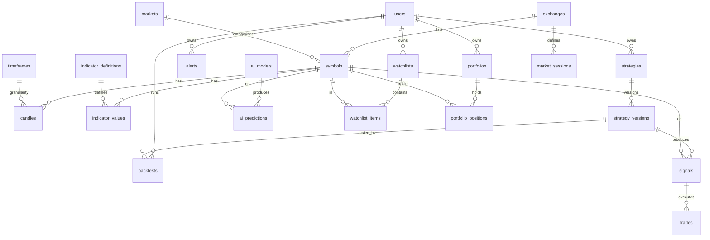

# Database Schema Design

> Target: **millions of candles**, thousands of symbols, multi-exchange, multi-timeframe.  
> Extension: **TimescaleDB** for time-series hypertables on `candles` and `indicator_values`.

---

## 1. Entity Relationship Overview

---

## 2. Reference Tables

### 2.1 `exchanges`

**Why:** Central registry of all connected data sources. Adapters map 1:1 to exchange rows.

| Column | Type | Constraints | Description |
|--------|------|-------------|-------------|
| `id` | UUID | PK, DEFAULT gen_random_uuid() | Internal ID |
| `code` | VARCHAR(32) | UNIQUE, NOT NULL | `nse`, `binance`, `bybit` |
| `name` | VARCHAR(128) | NOT NULL | Display name |
| `country` | VARCHAR(64) | NULL | Country of origin |
| `timezone` | VARCHAR(64) | NOT NULL | Default timezone (IANA) |
| `market_types` | VARCHAR(32)[] | NOT NULL | `{equity,crypto,forex}` |
| `api_base_url` | VARCHAR(512) | NULL | REST base URL |
| `ws_url` | VARCHAR(512) | NULL | WebSocket URL |
| `is_active` | BOOLEAN | NOT NULL, DEFAULT true | Enabled for data sync |
| `config` | JSONB | NOT NULL, DEFAULT '{}' | Rate limits, auth config refs |
| `created_at` | TIMESTAMPTZ | NOT NULL, DEFAULT now() | |
| `updated_at` | TIMESTAMPTZ | NOT NULL, DEFAULT now() | |

**Indexes:** `UNIQUE (code)` · `INDEX (is_active) WHERE is_active = true`

---

### 2.2 `markets`

**Why:** Classify symbols by asset class and regulatory market.

| Column | Type | Constraints | Description |
|--------|------|-------------|-------------|
| `id` | UUID | PK | |
| `code` | VARCHAR(32) | UNIQUE, NOT NULL | `nse_equity`, `crypto_spot` |
| `name` | VARCHAR(128) | NOT NULL | |
| `market_type` | VARCHAR(32) | NOT NULL | `equity`, `crypto`, `forex`, `commodity`, `futures`, `options` |
| `currency` | VARCHAR(8) | NOT NULL | Default quote currency |
| `created_at` | TIMESTAMPTZ | NOT NULL, DEFAULT now() | |

**Indexes:** `UNIQUE (code)` · `INDEX (market_type)`

---

### 2.3 `timeframes`

**Why:** Canonical timeframe registry. All candles and indicators reference this table.

| Column | Type | Constraints | Description |
|--------|------|-------------|-------------|
| `id` | SMALLINT | PK | Surrogate for compact FK |
| `code` | VARCHAR(8) | UNIQUE, NOT NULL | `1m`, `5m`, `1h`, `1d` |
| `name` | VARCHAR(32) | NOT NULL | Human-readable |
| `seconds` | INTEGER | NOT NULL | Duration in seconds |
| `sort_order` | SMALLINT | NOT NULL | UI ordering |

**Seed:** `1m=60`, `5m=300`, `15m=900`, `1h=3600`, `4h=14400`, `1d=86400`, `1w=604800`

---

## 3. Users

### 3.1 `users`

**Why:** Platform accounts for strategies, watchlists, alerts, portfolios, and RBAC.

| Column | Type | Constraints | Description |
|--------|------|-------------|-------------|
| `id` | UUID | PK | |
| `email` | VARCHAR(255) | UNIQUE, NOT NULL | Login email |
| `password_hash` | VARCHAR(255) | NOT NULL | bcrypt hash |
| `full_name` | VARCHAR(255) | NULL | |
| `role` | VARCHAR(32) | NOT NULL, DEFAULT 'user' | `user`, `admin`, `analyst` |
| `is_active` | BOOLEAN | NOT NULL, DEFAULT true | |
| `is_verified` | BOOLEAN | NOT NULL, DEFAULT false | |
| `subscription_tier` | VARCHAR(32) | NOT NULL, DEFAULT 'free' | `free`, `pro`, `enterprise` |
| `preferences` | JSONB | NOT NULL, DEFAULT '{}' | UI prefs, timezone |
| `last_login_at` | TIMESTAMPTZ | NULL | |
| `created_at` | TIMESTAMPTZ | NOT NULL, DEFAULT now() | |
| `updated_at` | TIMESTAMPTZ | NOT NULL, DEFAULT now() | |

**Indexes:** `UNIQUE (email)` · `INDEX (is_active, role)`

---

## 4. Symbols

### 4.1 `symbols`

**Why:** Unified instrument registry. Every candle, signal, and trade references a symbol.

| Column | Type | Constraints | Description |
|--------|------|-------------|-------------|
| `id` | UUID | PK | |
| `exchange_id` | UUID | FK → exchanges(id), NOT NULL | |
| `market_id` | UUID | FK → markets(id), NOT NULL | |
| `symbol_code` | VARCHAR(64) | NOT NULL | `RELIANCE`, `BTCUSDT` |
| `name` | VARCHAR(255) | NOT NULL | Full name |
| `base_asset` | VARCHAR(32) | NULL | `BTC` in BTCUSDT |
| `quote_asset` | VARCHAR(32) | NULL | `USDT` in BTCUSDT |
| `isin` | VARCHAR(16) | NULL | ISIN for Indian equities |
| `sector` | VARCHAR(128) | NULL | |
| `industry` | VARCHAR(128) | NULL | |
| `tick_size` | NUMERIC(18,8) | NOT NULL, DEFAULT 0.01 | |
| `lot_size` | INTEGER | NOT NULL, DEFAULT 1 | |
| `is_active` | BOOLEAN | NOT NULL, DEFAULT true | |
| `metadata` | JSONB | NOT NULL, DEFAULT '{}' | |
| `created_at` | TIMESTAMPTZ | NOT NULL, DEFAULT now() | |
| `updated_at` | TIMESTAMPTZ | NOT NULL, DEFAULT now() | |

**PK:** `id` · **Unique:** `(exchange_id, symbol_code)`

**Indexes:**
- `INDEX (market_id, is_active)`
- `INDEX (symbol_code)`
- `GIN (to_tsvector('english', name || ' ' || symbol_code))`

**Constraints:** `CHECK (tick_size > 0)` · `CHECK (lot_size > 0)`

---

## 5. Candles (High Volume — TimescaleDB Hypertable)

### 5.1 `candles`

**Why:** Core OHLCV data. Expected **millions to billions** of rows.

| Column | Type | Constraints | Description |
|--------|------|-------------|-------------|
| `symbol_id` | UUID | FK → symbols(id), NOT NULL | |
| `timeframe_id` | SMALLINT | FK → timeframes(id), NOT NULL | |
| `open_time` | TIMESTAMPTZ | NOT NULL | Partition key (UTC) |
| `close_time` | TIMESTAMPTZ | NOT NULL | |
| `open` | NUMERIC(18,8) | NOT NULL | |
| `high` | NUMERIC(18,8) | NOT NULL | |
| `low` | NUMERIC(18,8) | NOT NULL | |
| `close` | NUMERIC(18,8) | NOT NULL | |
| `volume` | NUMERIC(24,8) | NOT NULL, DEFAULT 0 | |
| `quote_volume` | NUMERIC(24,8) | NULL | Crypto quote volume |
| `trades_count` | INTEGER | NULL | |
| `is_complete` | BOOLEAN | NOT NULL, DEFAULT true | Forming vs completed |
| `source` | VARCHAR(32) | NOT NULL, DEFAULT 'live' | `live`, `historical`, `backfill` |

**PK:** `(symbol_id, timeframe_id, open_time)`

**Hypertable:** `create_hypertable('candles', 'open_time', chunk_time_interval => INTERVAL '1 month')`

**Indexes:**
- `(symbol_id, timeframe_id, open_time DESC)` — latest bars
- BRIN on `open_time` — sequential scans

**Constraints:**
- `CHECK (low <= LEAST(open, close) AND high >= GREATEST(open, close))`
- `CHECK (volume >= 0)`
- `CHECK (open > 0 AND high > 0 AND low > 0 AND close > 0)`

**Compression:** TimescaleDB after 7 days, segment by `symbol_id, timeframe_id`.

---

## 6. Indicators

### 6.1 `indicator_definitions`

**Why:** Registry of available indicators (built-in + plugins).

| Column | Type | Constraints | Description |
|--------|------|-------------|-------------|
| `id` | UUID | PK | |
| `code` | VARCHAR(64) | UNIQUE, NOT NULL | `rsi`, `macd` |
| `name` | VARCHAR(128) | NOT NULL | |
| `category` | VARCHAR(64) | NOT NULL | `momentum`, `trend`, `volatility`, `volume` |
| `description` | TEXT | NULL | |
| `parameters_schema` | JSONB | NOT NULL | JSON Schema for params |
| `output_schema` | JSONB | NOT NULL | JSON Schema for output |
| `is_builtin` | BOOLEAN | NOT NULL, DEFAULT false | |
| `is_active` | BOOLEAN | NOT NULL, DEFAULT true | |
| `created_at` | TIMESTAMPTZ | NOT NULL, DEFAULT now() | |

---

### 6.2 `indicator_values`

**Why:** Computed indicator results. Second-largest table after candles.

| Column | Type | Constraints | Description |
|--------|------|-------------|-------------|
| `symbol_id` | UUID | FK → symbols(id), NOT NULL | |
| `timeframe_id` | SMALLINT | FK → timeframes(id), NOT NULL | |
| `indicator_id` | UUID | FK → indicator_definitions(id), NOT NULL | |
| `params_hash` | VARCHAR(64) | NOT NULL | Hash of parameters |
| `open_time` | TIMESTAMPTZ | NOT NULL | Aligns with candle |
| `values` | JSONB | NOT NULL | `{"rsi": 65.3}` |
| `computed_at` | TIMESTAMPTZ | NOT NULL, DEFAULT now() | |

**PK:** `(symbol_id, timeframe_id, indicator_id, params_hash, open_time)`

**Hypertable:** Partition on `open_time`, monthly chunks.

**Index:** `(symbol_id, timeframe_id, indicator_id, open_time DESC)`

---

## 7. Strategies & Signals

### 7.1 `strategies`

**Why:** User-owned strategy configurations referencing plugins.

| Column | Type | Constraints | Description |
|--------|------|-------------|-------------|
| `id` | UUID | PK | |
| `user_id` | UUID | FK → users(id), NOT NULL | Owner |
| `code` | VARCHAR(64) | NOT NULL | Plugin code |
| `name` | VARCHAR(128) | NOT NULL | User-defined name |
| `description` | TEXT | NULL | |
| `is_active` | BOOLEAN | NOT NULL, DEFAULT true | |
| `is_public` | BOOLEAN | NOT NULL, DEFAULT false | |
| `created_at` | TIMESTAMPTZ | NOT NULL, DEFAULT now() | |
| `updated_at` | TIMESTAMPTZ | NOT NULL, DEFAULT now() | |

**Index:** `(user_id, is_active)` · `(code)`

---

### 7.2 `strategy_versions`

**Why:** Immutable version history for reproducible backtests and signals.

| Column | Type | Constraints | Description |
|--------|------|-------------|-------------|
| `id` | UUID | PK | |
| `strategy_id` | UUID | FK → strategies(id) ON DELETE CASCADE | |
| `version_number` | INTEGER | NOT NULL | Per-strategy increment |
| `parameters` | JSONB | NOT NULL | Params snapshot |
| `timeframes` | VARCHAR(8)[] | NOT NULL | Required TFs |
| `symbols_filter` | JSONB | NULL | Symbol universe |
| `changelog` | TEXT | NULL | |
| `created_at` | TIMESTAMPTZ | NOT NULL, DEFAULT now() | |

**Unique:** `(strategy_id, version_number)` · **Check:** `version_number > 0`

---

### 7.3 `signals`

**Why:** Actionable trading signals from the Signal Engine.

| Column | Type | Constraints | Description |
|--------|------|-------------|-------------|
| `id` | UUID | PK | |
| `strategy_version_id` | UUID | FK → strategy_versions(id) | |
| `symbol_id` | UUID | FK → symbols(id) | |
| `timeframe_id` | SMALLINT | FK → timeframes(id) | |
| `direction` | VARCHAR(8) | NOT NULL | `LONG`, `SHORT`, `NEUTRAL` |
| `strength` | VARCHAR(16) | NOT NULL | `WEAK`, `MODERATE`, `STRONG` |
| `confidence` | NUMERIC(5,4) | NOT NULL | 0.0 – 1.0 |
| `entry_price` | NUMERIC(18,8) | NULL | |
| `stop_loss` | NUMERIC(18,8) | NULL | |
| `take_profit` | NUMERIC(18,8) | NULL | |
| `signal_time` | TIMESTAMPTZ | NOT NULL | |
| `expires_at` | TIMESTAMPTZ | NULL | |
| `metadata` | JSONB | NOT NULL, DEFAULT '{}' | |
| `status` | VARCHAR(16) | NOT NULL, DEFAULT 'active' | |
| `created_at` | TIMESTAMPTZ | NOT NULL, DEFAULT now() | |

**Indexes:**
- `(symbol_id, signal_time DESC)`
- `(strategy_version_id, signal_time DESC)`
- `(status, signal_time DESC) WHERE status = 'active'`

**Check:** `confidence BETWEEN 0 AND 1` · `direction IN ('LONG','SHORT','NEUTRAL')`

---

## 8. Trades & Backtests

### 8.1 `trades`

**Why:** Executed trades from paper or live trading.

| Column | Type | Constraints | Description |
|--------|------|-------------|-------------|
| `id` | UUID | PK | |
| `user_id` | UUID | FK → users(id) | |
| `signal_id` | UUID | FK → signals(id), NULL | |
| `backtest_id` | UUID | FK → backtests(id), NULL | |
| `symbol_id` | UUID | FK → symbols(id) | |
| `side` | VARCHAR(8) | NOT NULL | `BUY`, `SELL` |
| `quantity` | NUMERIC(18,8) | NOT NULL | |
| `entry_price` | NUMERIC(18,8) | NOT NULL | |
| `exit_price` | NUMERIC(18,8) | NULL | |
| `stop_loss` | NUMERIC(18,8) | NULL | |
| `take_profit` | NUMERIC(18,8) | NULL | |
| `commission` | NUMERIC(18,8) | DEFAULT 0 | |
| `slippage` | NUMERIC(18,8) | DEFAULT 0 | |
| `pnl` | NUMERIC(18,8) | NULL | |
| `pnl_percent` | NUMERIC(8,4) | NULL | |
| `trade_type` | VARCHAR(16) | NOT NULL | `paper`, `live`, `backtest` |
| `status` | VARCHAR(16) | DEFAULT 'open' | |
| `opened_at` | TIMESTAMPTZ | NOT NULL | |
| `closed_at` | TIMESTAMPTZ | NULL | |
| `metadata` | JSONB | DEFAULT '{}' | |
| `created_at` | TIMESTAMPTZ | DEFAULT now() | |

**Indexes:** `(user_id, status, opened_at DESC)` · `(symbol_id, opened_at DESC)` · `(backtest_id)`

---

### 8.2 `backtests`

**Why:** Historical strategy simulation results.

| Column | Type | Constraints | Description |
|--------|------|-------------|-------------|
| `id` | UUID | PK | |
| `user_id` | UUID | FK → users(id) | |
| `strategy_version_id` | UUID | FK → strategy_versions(id) | |
| `name` | VARCHAR(255) | NOT NULL | |
| `status` | VARCHAR(16) | DEFAULT 'pending' | |
| `start_date` | DATE | NOT NULL | |
| `end_date` | DATE | NOT NULL | |
| `initial_capital` | NUMERIC(18,2) | NOT NULL | |
| `symbols` | UUID[] | NOT NULL | |
| `timeframes` | VARCHAR(8)[] | NOT NULL | |
| `parameters_override` | JSONB | NULL | |
| `commission_rate` | NUMERIC(8,6) | DEFAULT 0.001 | |
| `slippage_rate` | NUMERIC(8,6) | DEFAULT 0.0005 | |
| `results` | JSONB | NULL | |
| `metrics` | JSONB | NULL | Sharpe, max DD, win rate |
| `error_message` | TEXT | NULL | |
| `started_at` | TIMESTAMPTZ | NULL | |
| `completed_at` | TIMESTAMPTZ | NULL | |
| `created_at` | TIMESTAMPTZ | DEFAULT now() | |

**Check:** `end_date > start_date` · `initial_capital > 0`

---

## 9. AI

### 9.1 `ai_models`

**Why:** Registry of trainable AI model plugins and artifacts.

| Column | Type | Constraints | Description |
|--------|------|-------------|-------------|
| `id` | UUID | PK | |
| `user_id` | UUID | FK → users(id), NULL | NULL = platform model |
| `code` | VARCHAR(64) | NOT NULL | Plugin code |
| `name` | VARCHAR(128) | NOT NULL | |
| `description` | TEXT | NULL | |
| `model_type` | VARCHAR(32) | NOT NULL | `classification`, `regression`, `forecast` |
| `parameters` | JSONB | NOT NULL | Hyperparameters |
| `feature_config` | JSONB | NOT NULL | Required features |
| `status` | VARCHAR(16) | DEFAULT 'registered' | |
| `artifact_path` | VARCHAR(512) | NULL | |
| `metrics` | JSONB | NULL | Training metrics |
| `version` | INTEGER | DEFAULT 1 | |
| `is_active` | BOOLEAN | DEFAULT false | Live inference |
| `trained_at` | TIMESTAMPTZ | NULL | |
| `created_at` | TIMESTAMPTZ | DEFAULT now() | |
| `updated_at` | TIMESTAMPTZ | DEFAULT now() | |

---

### 9.2 `ai_predictions`

**Why:** Stored inference results for audit and accuracy tracking.

| Column | Type | Constraints | Description |
|--------|------|-------------|-------------|
| `id` | UUID | PK | |
| `model_id` | UUID | FK → ai_models(id) | |
| `symbol_id` | UUID | FK → symbols(id) | |
| `timeframe_id` | SMALLINT | FK → timeframes(id) | |
| `prediction_time` | TIMESTAMPTZ | NOT NULL | |
| `target_time` | TIMESTAMPTZ | NOT NULL | |
| `prediction` | JSONB | NOT NULL | direction, probability |
| `confidence` | NUMERIC(5,4) | NOT NULL | |
| `actual_outcome` | JSONB | NULL | Filled post-target |
| `created_at` | TIMESTAMPTZ | DEFAULT now() | |

**Hypertable:** Partition on `prediction_time`.

---

## 10. Alerts & Watchlists

### 10.1 `alerts`

**Why:** User-defined conditions triggering notifications.

| Column | Type | Constraints | Description |
|--------|------|-------------|-------------|
| `id` | UUID | PK | |
| `user_id` | UUID | FK → users(id) | |
| `name` | VARCHAR(128) | NOT NULL | |
| `symbol_id` | UUID | FK → symbols(id), NULL | NULL = market-wide |
| `alert_type` | VARCHAR(32) | NOT NULL | `price`, `indicator`, `signal`, `smc` |
| `condition` | JSONB | NOT NULL | Condition definition |
| `channels` | VARCHAR(16)[] | NOT NULL | email, push, webhook |
| `webhook_url` | VARCHAR(512) | NULL | |
| `is_active` | BOOLEAN | DEFAULT true | |
| `is_recurring` | BOOLEAN | DEFAULT true | |
| `last_triggered_at` | TIMESTAMPTZ | NULL | |
| `trigger_count` | INTEGER | DEFAULT 0 | |
| `cooldown_minutes` | INTEGER | DEFAULT 60 | |
| `created_at` | TIMESTAMPTZ | DEFAULT now() | |
| `updated_at` | TIMESTAMPTZ | DEFAULT now() | |

---

### 10.2 `watchlists`

| Column | Type | Constraints | Description |
|--------|------|-------------|-------------|
| `id` | UUID | PK | |
| `user_id` | UUID | FK → users(id) | |
| `name` | VARCHAR(128) | NOT NULL | |
| `description` | TEXT | NULL | |
| `is_default` | BOOLEAN | DEFAULT false | |
| `sort_order` | INTEGER | DEFAULT 0 | |
| `created_at` | TIMESTAMPTZ | DEFAULT now() | |
| `updated_at` | TIMESTAMPTZ | DEFAULT now() | |

**Unique:** `(user_id, name)`

---

### 10.3 `watchlist_items`

| Column | Type | Constraints | Description |
|--------|------|-------------|-------------|
| `id` | UUID | PK | |
| `watchlist_id` | UUID | FK → watchlists(id) ON DELETE CASCADE | |
| `symbol_id` | UUID | FK → symbols(id) | |
| `notes` | TEXT | NULL | |
| `sort_order` | INTEGER | DEFAULT 0 | |
| `added_at` | TIMESTAMPTZ | DEFAULT now() | |

**Unique:** `(watchlist_id, symbol_id)`

---

## 11. Portfolios

### 11.1 `portfolios`

| Column | Type | Constraints | Description |
|--------|------|-------------|-------------|
| `id` | UUID | PK | |
| `user_id` | UUID | FK → users(id) | |
| `name` | VARCHAR(128) | NOT NULL | |
| `portfolio_type` | VARCHAR(16) | NOT NULL | `paper`, `live` |
| `base_currency` | VARCHAR(8) | DEFAULT 'INR' | |
| `initial_balance` | NUMERIC(18,2) | NOT NULL | |
| `current_balance` | NUMERIC(18,2) | NOT NULL | |
| `is_active` | BOOLEAN | DEFAULT true | |
| `created_at` | TIMESTAMPTZ | DEFAULT now() | |
| `updated_at` | TIMESTAMPTZ | DEFAULT now() | |

---

### 11.2 `portfolio_positions`

| Column | Type | Constraints | Description |
|--------|------|-------------|-------------|
| `id` | UUID | PK | |
| `portfolio_id` | UUID | FK → portfolios(id) ON DELETE CASCADE | |
| `symbol_id` | UUID | FK → symbols(id) | |
| `side` | VARCHAR(8) | NOT NULL | `LONG`, `SHORT` |
| `quantity` | NUMERIC(18,8) | NOT NULL | |
| `avg_entry_price` | NUMERIC(18,8) | NOT NULL | |
| `current_price` | NUMERIC(18,8) | NULL | |
| `unrealized_pnl` | NUMERIC(18,2) | NULL | |
| `opened_at` | TIMESTAMPTZ | NOT NULL | |
| `updated_at` | TIMESTAMPTZ | DEFAULT now() | |

**Unique:** `(portfolio_id, symbol_id, side)`

---

## 12. Market Context

### 12.1 `market_sessions`

**Why:** Trading hours and holidays per exchange (NSE 09:15–15:30 IST vs 24/7 crypto).

| Column | Type | Constraints | Description |
|--------|------|-------------|-------------|
| `id` | UUID | PK | |
| `exchange_id` | UUID | FK → exchanges(id) | |
| `session_type` | VARCHAR(32) | NOT NULL | `regular`, `pre_market`, `post_market` |
| `day_of_week` | SMALLINT | NULL | 0=Mon. NULL for holidays |
| `open_time` | TIME | NOT NULL | Local exchange time |
| `close_time` | TIME | NOT NULL | |
| `timezone` | VARCHAR(64) | NOT NULL | |
| `is_holiday` | BOOLEAN | DEFAULT false | |
| `holiday_date` | DATE | NULL | |
| `holiday_name` | VARCHAR(128) | NULL | |
| `created_at` | TIMESTAMPTZ | DEFAULT now() | |

---

### 12.2 `economic_events`

**Why:** Macro events affecting trading and AI features.

| Column | Type | Constraints | Description |
|--------|------|-------------|-------------|
| `id` | UUID | PK | |
| `title` | VARCHAR(255) | NOT NULL | |
| `event_type` | VARCHAR(64) | NOT NULL | `earnings`, `rbi_policy`, `nfp` |
| `country` | VARCHAR(64) | NOT NULL | |
| `impact` | VARCHAR(16) | NOT NULL | `low`, `medium`, `high` |
| `symbol_id` | UUID | FK → symbols(id), NULL | Related symbol |
| `scheduled_at` | TIMESTAMPTZ | NOT NULL | |
| `actual_value` | VARCHAR(64) | NULL | |
| `forecast_value` | VARCHAR(64) | NULL | |
| `previous_value` | VARCHAR(64) | NULL | |
| `source` | VARCHAR(128) | NULL | |
| `created_at` | TIMESTAMPTZ | DEFAULT now() | |

**Index:** `(scheduled_at DESC)` · `(event_type, scheduled_at DESC)`

---

### 12.3 `news`

**Why:** News sentiment and event correlation for AI features and alerts.

| Column | Type | Constraints | Description |
|--------|------|-------------|-------------|
| `id` | UUID | PK | |
| `title` | VARCHAR(512) | NOT NULL | |
| `summary` | TEXT | NULL | |
| `source` | VARCHAR(128) | NOT NULL | |
| `source_url` | VARCHAR(1024) | NULL | |
| `published_at` | TIMESTAMPTZ | NOT NULL | |
| `symbols` | UUID[] | NULL | Related symbol IDs |
| `sentiment` | VARCHAR(16) | NULL | `positive`, `negative`, `neutral` |
| `sentiment_score` | NUMERIC(5,4) | NULL | -1.0 to 1.0 |
| `tags` | VARCHAR(64)[] | NULL | |
| `metadata` | JSONB | DEFAULT '{}' | |
| `created_at` | TIMESTAMPTZ | DEFAULT now() | |

**Indexes:**
- `(published_at DESC)`
- `GIN (to_tsvector('english', title || ' ' || COALESCE(summary, '')))`
- `GIN (symbols)` — symbol array lookup

---

## 13. Audit

### 13.1 `audit_logs`

**Why:** Immutable audit trail for security, compliance, and debugging. Extends Sprint 1 foundation.

| Column | Type | Constraints | Description |
|--------|------|-------------|-------------|
| `id` | UUID | PK | |
| `user_id` | UUID | FK → users(id), NULL | NULL for system events |
| `event_type` | VARCHAR(64) | NOT NULL | `login`, `signal_generated`, `trade_executed` |
| `entity_type` | VARCHAR(64) | NULL | `strategy`, `trade`, `alert` |
| `entity_id` | UUID | NULL | Referenced entity |
| `action` | VARCHAR(32) | NOT NULL | `create`, `update`, `delete`, `execute` |
| `message` | TEXT | NOT NULL | Human-readable description |
| `metadata` | JSONB | DEFAULT '{}' | Request context, IP, changes |
| `ip_address` | INET | NULL | |
| `created_at` | TIMESTAMPTZ | NOT NULL, DEFAULT now() | |

**Indexes:**
- `(user_id, created_at DESC)`
- `(event_type, created_at DESC)`
- `(entity_type, entity_id) WHERE entity_id IS NOT NULL`

**Retention:** Partition by month; archive to cold storage after 12 months.

---

## 14. Table Summary

| Table | Est. Row Count | Partitioning | Why It Exists |
|-------|----------------|--------------|---------------|
| `exchanges` | < 50 | No | Adapter registry |
| `markets` | < 20 | No | Asset class taxonomy |
| `timeframes` | < 15 | No | Canonical TF codes |
| `users` | 10K – 1M | No | Auth & ownership |
| `symbols` | 5K – 50K | No | Unified instrument registry |
| `candles` | **100M – 1B+** | TimescaleDB monthly | Core OHLCV data |
| `indicator_definitions` | < 500 | No | Plugin registry |
| `indicator_values` | **50M – 500M** | TimescaleDB monthly | Computed indicators |
| `strategies` | 10K – 100K | No | User strategy configs |
| `strategy_versions` | 50K – 500K | No | Immutable version history |
| `signals` | 1M – 10M | Optional monthly | Trading signals |
| `trades` | 1M – 50M | Optional monthly | Executed trades |
| `backtests` | 100K – 1M | No | Simulation results |
| `ai_models` | < 1K | No | Model registry |
| `ai_predictions` | 10M – 100M | TimescaleDB monthly | Inference output |
| `alerts` | 100K – 1M | No | User alert rules |
| `watchlists` | 100K – 1M | No | Symbol collections |
| `watchlist_items` | 1M – 10M | No | Watchlist membership |
| `portfolios` | 100K – 1M | No | Account tracking |
| `portfolio_positions` | 500K – 5M | No | Open positions |
| `market_sessions` | < 1K | No | Trading hours |
| `economic_events` | 100K – 1M | No | Macro calendar |
| `news` | 1M – 10M | Optional monthly | News feed |
| `audit_logs` | 10M+ | Monthly | Compliance trail |
