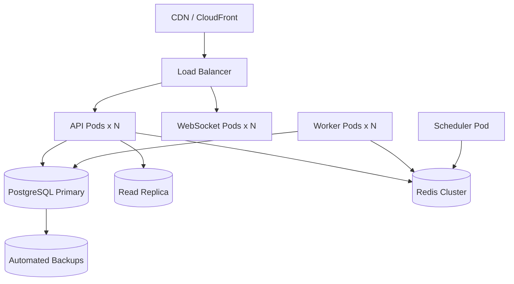

# Deployment Architecture

## Environments

| Environment | Purpose | Infrastructure |
|-------------|---------|----------------|
| `development` | Local dev | Docker Compose |
| `staging` | Pre-production testing | Cloud VMs / K8s |
| `production` | Live platform | Kubernetes cluster |

## Docker Compose (Development)

```yaml
services:
  api:          # FastAPI (port 8000)
  worker:       # Celery workers
  scheduler:    # Celery Beat
  db:           # PostgreSQL 16 + TimescaleDB
  redis:        # Redis 7
  pgadmin:      # Optional DB admin
```

## Production Topology



## Services

| Service | Replicas | Resources |
|---------|----------|-----------|
| API | 2–8 (auto-scale) | 1 CPU, 2 GB RAM |
| WebSocket | 2–4 | 1 CPU, 1 GB RAM |
| Celery Worker (data) | 2–4 | 2 CPU, 4 GB RAM |
| Celery Worker (compute) | 2–4 | 2 CPU, 4 GB RAM |
| Celery Worker (AI) | 1–2 | 4 CPU, 8 GB RAM |
| PostgreSQL | 1 primary + 1 replica | 4 CPU, 16 GB RAM, SSD |
| Redis | 3-node cluster | 2 GB RAM each |

## CI/CD

1. Push to `main` → run tests + lint + type check
2. Build Docker images → push to registry
3. Deploy to staging → smoke tests
4. Manual approval → deploy to production
5. Run Alembic migrations before API rollout

## Secrets Management

- Environment variables via cloud secret manager (AWS Secrets Manager / Vault)
- Never commit `.env` with real credentials
- API keys for exchanges stored encrypted in `exchanges.config`

## Monitoring

| Tool | Purpose |
|------|---------|
| Prometheus + Grafana | Metrics dashboards |
| Loguru → ELK/Loki | Structured log aggregation |
| Sentry | Error tracking |
| Uptime monitor | `/api/v1/health` external probe |

## Backup Strategy

| Data | Frequency | Retention |
|------|-----------|-----------|
| PostgreSQL full | Daily | 30 days |
| PostgreSQL WAL | Continuous | 7 days |
| Redis | RDB snapshot hourly | 24 hours |
| AI model artifacts | On training | Indefinite (S3) |
