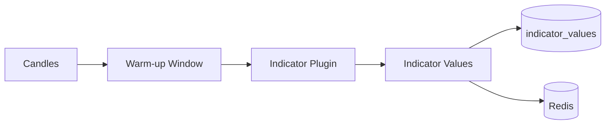

# Indicator Engine Design

## Overview

Plugin-based technical indicator computation engine. Indicators are discovered at startup, synced to `indicator_definitions`, and computed on-demand or via event-driven pipeline.

## Built-in Indicators (Phase 1)

| Category | Indicators |
|----------|------------|
| Trend | SMA, EMA, WMA, VWAP, Supertrend, ADX |
| Momentum | RSI, MACD, Stochastic, CCI, Williams %R |
| Volatility | Bollinger Bands, ATR, Keltner Channel |
| Volume | OBV, Volume Profile, MFI, CMF |
| Custom | Ichimoku, Pivot Points, Fibonacci |

## Computation Model

## Multi-Timeframe

Indicators computed per `(symbol_id, timeframe_id)`. Strategies declare required timeframes; engine fetches all before strategy evaluation.

## Caching

Latest values cached in Redis (`indicator:{symbol}:{tf}:{code}:{hash}:latest`, TTL 120s). Invalidated on `MarketUpdated`.

## Plugin Extension

See [Plugin Architecture](../architecture/plugins.md#3-indicator-plugins).

## API

See [Indicator Endpoints](../api/endpoints.md#7-indicators).
